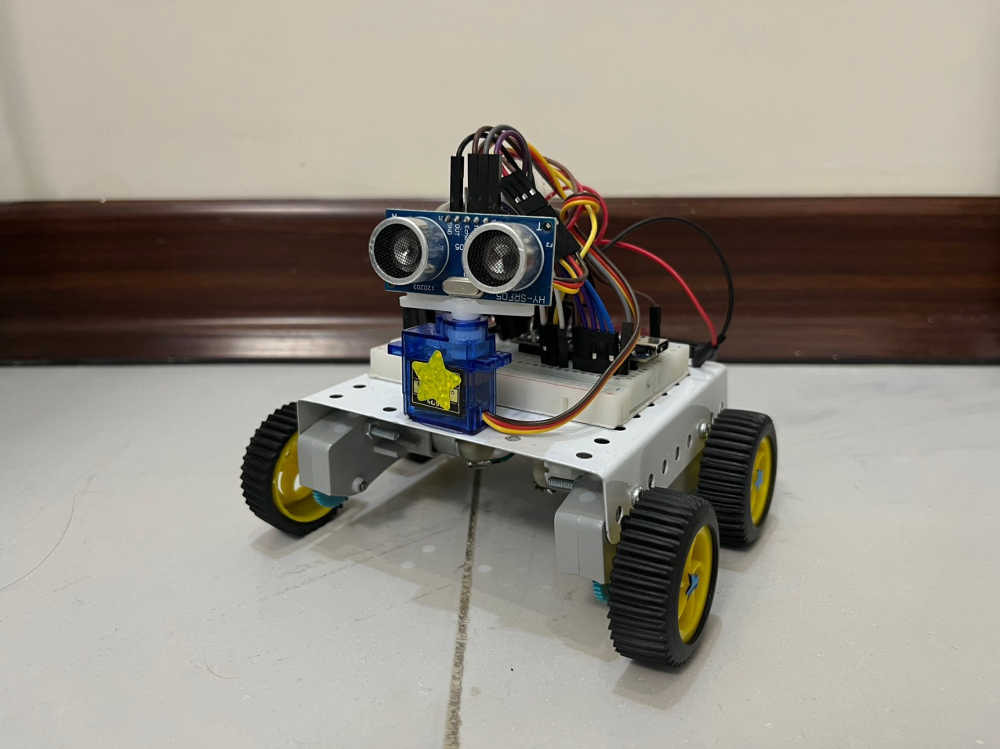
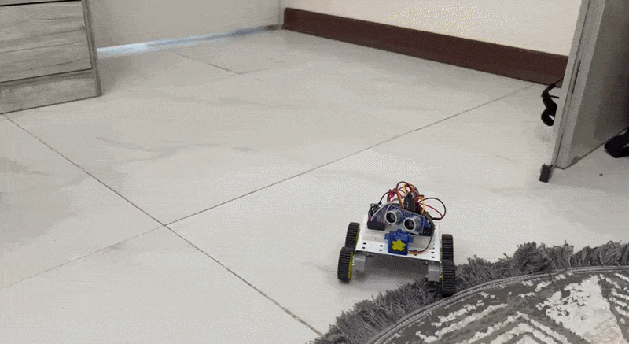
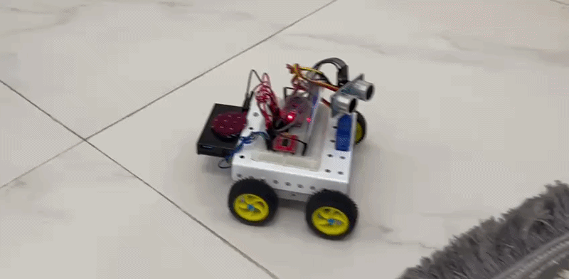

# Obstacle Avoiding Robot 🤖

<p align="center">
  
</p>

<p align="center">
  An autonomous Arduino-based robot that detects obstacles using an ultrasonic sensor and changes its direction to avoid collisions.
</p>


## ❓ How It Works

The robot uses an **Arduino Nano**, **HC-SR04 ultrasonic sensor**, **TB6612FNG motor driver**, and a **servo motor** to scan its surroundings and navigate through obstacles.
The ultrasonic sensor continuously measures the distance in front of the robot.

When the path is clear, the robot moves forward.

If an obstacle is detected within the safety distance, the robot stops and uses the servo to rotate the ultrasonic sensor and measure the surroundings.

Based on the measured distances, the robot chooses a direction with more available space and turns accordingly.

```text
              Start
                │
                ▼
        Measure front distance
                │
        ┌───────┴────────┐
        │                │
     Clear             Obstacle
        │                │
        ▼                ▼
   Move forward        Stop
                         │
                         ▼
                  Scan surroundings
                         │
                    ┌────┴────┐
                    │         │
                 Left      Right
                    │         │
                    └────┬────┘
                         ▼
                  Choose direction
                         │
                         ▼
                       Turn
                         │
                         ▼
                  Continue moving
```

## 🛠️ Hardware

| Component                 | Quantity |
| ------------------------- | -------: |
| Arduino Nano              |        1 |
| TB6612FNG Motor Driver    |        1 |
| HC-SR04 Ultrasonic Sensor |        1 |
| Servo Motor               |        1 |
| DC Motors                 |        2 |
| Robot Chassis             |        1 |
| Battery                   |        1 |
| Tank Wheels               |        2 |

## ✨ Pin Connections

### TB6612FNG

| Pin  | Arduino Nano |
| ---- | -----------: |
| PWMA |           D5 |
| AIN1 |           D8 |
| AIN2 |           D9 |
| PWMB |           D3 |
| BIN1 |          D10 |
| BIN2 |          D11 |
| STBY |           D7 |

### HC-SR04

| Pin  | Arduino Nano |
| ---- | -----------: |
| TRIG |          D12 |
| ECHO |          D13 |

### Servo

| Pin    | Arduino Nano |
| ------ | -----------: |
| Signal |           D4 |


## 🖥️ Software

The robot is programmed in **Arduino C/C++**.

### Main Control Tasks

* Reading the ultrasonic sensor
* Controlling the servo position
* Controlling motor direction and speed
* Detecting obstacles
* Scanning left and right
* Choosing a turning direction
* Returning to forward movement

## 📼 Demo

moving forward, scaning, moving backwards and redirection:

<p align="center">
  
</p>

headtilt on servo to check each side:
<p align="center">
  
</p>


## ✨ Author & License

**PaniBitLab**

This project is open-source and available for learning and educational purposes however; If you use this project or its ideas in your own work, please consider mentioning this repository and giving it a star. :)


This project is open-source and available for learning and personal use.
